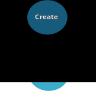

.. pproject documentation master file, created by
   sphinx-quickstart on Sun Feb 18 12:48:48 2018.
   You can adapt this file completely to your liking, but it should at least
   contain the root `toctree` directive.

pproject
########

|

**pproject** is a terminal-tool (for bash and zsh) to create, update, test and
build python projects inside the conda-environment.

It focuses on decreasing the manual operations required during the
development-circle consisting of creation, development, test, build,
release and document.

    Development-circle as implemented in the pproject-tool.

pproject is mainly written in python (3.6), but also uses bash (for
autoactivation and auto-update-functionalities in the shell).

The python-projects created with this tool are using the
**company-namespace-project**-naming-style.

Including
*********
* easy creation of new python-projects (using
  `cookiecutter <https://github.com/audreyr/cookiecutter>`_)

  These projects include:
      * automated initialization as a git repository
      * automated definition of git-remote url (GitLab or GitHub)
      * automated creation of initial project specific
        `conda <https://conda.io/docs/>`_-environment
* automated or manual updates of project specific conda-environments based on
  projects meta.yaml-file
* easy incrementation of projects version (using semantic versioning)
* `sphinx <http://www.sphinx-doc.org/en/master/>`_-documentation (html and pdf)
  of projects
* autoactivation of projects conda-environment when entering the project path
  and deactivation when leaving
* automated testing of projects during build and release (using
  `pytest <https://docs.pytest.org/en/latest/>`_)
* build conda-package out of project with optionally publishing on own
  conda-repository-server
* easy rollout of projects as a conda-package in their own conda-environment
  either local or on another host.

Content
*******

.. toctree::
    :maxdepth: 1

    installation.rst
    configuration.rst
    usage.rst
    tutorial.rst
    concepts.rst
    pprojectmodule.rst
    license.rst
    authors.rst
    acknowledgments.rst

For other ouroboros-packages see `ouroboros-main-page
<https://www.ouroboros.info>`_.
