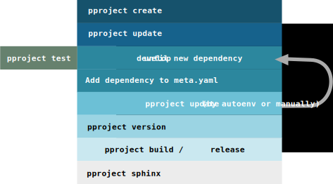

Tutorial
********

.. contents::

    Complete pproject workflow, beginning with creation of the project and ending
    with release and documentation.

Configuration
^^^^^^^^^^^^^
Customize the pproject-config-file located at
~/.config/pproject/pproject_config.yml.
You should change the default company and the gitlab-settings for your own
needs.

Make sure all your groups you want to use are in the following style:
    COMPANY-NAMESPACE

We recommend something like:
    ouroboros-products and ouroboros-modules

Also create a gitlab-token (if not already created) and insert the token inside
the config-file. Run all steps as described in the configuration section in the
pproject-documentation (everything will be much easier if you also enable
pproject autoenv with pproject autoenv_toggle like described in this section).

Now all requirements are satisfied.

Creation
^^^^^^^^
First you have to decide which kind of project you want to develop.

Now switch to the terminal and inside the folder where your project should be
placed. Create the project with the pproject create command.

Example:

    You want to create a product named dummy which uses python 3.6.
    You defined example as your companies name in the config-file.
    Then you would use the following command:

    .. code-block:: bash

        pproject create products -n dummy -v 3.6

You can also create projects connected with your gitlab-instance.

Example:

    .. code-block:: bash

        pproject create --remote products -n dummy -v 3.6

pproject collects the related skeleton for this python-version and replaces the
template variables with the inputs and the settings as defined in the
config-file. Then it creates resulting folder with combined contents and the
base conda-environment for this project.

Update and autoenv
^^^^^^^^^^^^^^^^^^
Now in terminal change to the created folder. In our example:

.. code-block:: bash

    cd example-products-dummy

If you activated autoenv in your .bashrc/.zshrc the related conda-environment
is activated automatically when entering the project-folder.
Else you can set autoenv to be activated with:

.. code-block:: bash

    pproject autoenv_toggle

You can also activate it manually with:

.. code-block:: bash

    pproject autoenv

The conda-environment is activated.

List current environment content
^^^^^^^^^^^^^^^^^^^^^^^^^^^^^^^^
You can list currently installed packages with:

.. code-block:: bash

    conda list

Testing and developing
^^^^^^^^^^^^^^^^^^^^^^
Now you should write the tests for your project using pytest inside the
folder tests. Run them with:

.. code-block:: bash

    pproject test

They will fail.

Edit your projects code at (rename YOUR_CODE.py to what you like):

.. code-block:: bash

    example-products-dummy/example/products/dummy/YOUR_CODE.py

Change the code until running the pproject test command succeed.

Dependency handling
^^^^^^^^^^^^^^^^^^^
Imagine you would need a third-party-package inside your project now.
For example, numpy. Add the import to your code.
Then add this dependency to the meta.yaml file at the requirements-run-section.

If autoenv is set, pproject detects changes in the meta.yaml
(md5sum-comparison of hash.md5 and new md5sum of meta.yaml-file) and
automatically trigger your environment to be recreated (using pproject update).
This will remove your current environment and rebuild it with the new
dependency list. Else (if autoenv is deactivated) you have to run the update
manually running:

.. code-block:: bash

    pproject update

resulting in the same result.

List the packages of the environment again with:

.. code-block:: bash

    conda list

Now numpy is also listed to be installed in the environment.

Showing details of current project
^^^^^^^^^^^^^^^^^^^^^^^^^^^^^^^^^^
Perhaps you would like to know some details about your current project at this
point. In this time run:

.. code-block:: bash

    pproject info project

This will list informations about your current project and the pproject-tool itself.

You can also list currrent pproject-configuration with:

.. code-block:: bash

    pproject info global

Version control and tagging
^^^^^^^^^^^^^^^^^^^^^^^^^^^
Continue developing, testing and updating your project using the described
commands yet.

Assume your project will be done at this point. Important: make sure all tests
pass at this point.

Now add and commit your changes to git.

Lets say the resulting package should be the first major version of your
package. Running:

.. code-block:: bash

    pproject version -m "MESSAGE" major

This will tag your project with the version “1.0.0”.

Now your project is tested, your branch is up to date and also tagged.

We arrive at the final steps: building/releasing and documentation

Converting your project to a conda-package (Building)
^^^^^^^^^^^^^^^^^^^^^^^^^^^^^^^^^^^^^^^^^^^^^^^^^^^^^
You simply can create a conda-package from your project at this point with:

.. code-block:: bash

    pproject build

This will build your package. Note that the package will only be available
local cause it is stored in your local conda-build channel
(/var/local/conda/conda-bld/linux-64).

You can either scp it to your conda-repository-server and update the index.
scp to the servers conda-bld/linux-64 folder and run:

.. code-block:: bash

    conda index .

there.

Alternatively you can build the package and publish it there automatically
running:

.. code-block:: bash

    pproject build --publish

In both ways the package is available for you and your colleagues now.

.. warning::
    Building a package is only possible if some checks are passed.

    These tests are:
        * checking if all tests defined inside the **tests**-folder pass
        * checking if no uncommited stuff in branch
        * checking if current state is tagged
        * checking if current tag also pushed to origin

    Only if these checks pass, the package will be build.

Releasing project (Rollout)
^^^^^^^^^^^^^^^^^^^^^^^^^^^
Assuming the package should also be released inside an own conda-environment
as a conda-package on either localhost or another host (be sure to add your
public ssh-key to the destination host before) you could also run:

.. code-block:: bash

    pproject release -d USERNAME@DESTINATIONHOST

or

.. code-block:: bash

    pproject release -d localhost

This creates the envrionment PACKAGENAME_env on the destination with the
package with all its dependencies in it. If the environment already exists on
the destination it will be removed and recreated like using the pproject update
command during developing.

.. note::
    For traceability reason releasing a package with **pproject release**
    stores information about when which user released what on the server.

    These informations are stored inside **~/.pproject.log** on the
    destination server.

    The result looks like the following:

        .. code-block:: bash

            2018-03-24T12:49:59.432033 [ektom@gallifrey] CREATE ouroboros-testing-example_env [SOURCE: master 1.0.1]

Document your project
^^^^^^^^^^^^^^^^^^^^^
Finally you would like to create a documentation for your project.
We support sphinx in this case. Simply run:

.. code-block:: bash

    pproject sphinx

This will set up all requirements for the documentation assuming you added
docstrings either in numpy- or google-documentation-style and creates the
resulting html files inside the folder build.

Congratulation you successfully created your first project with pproject.
